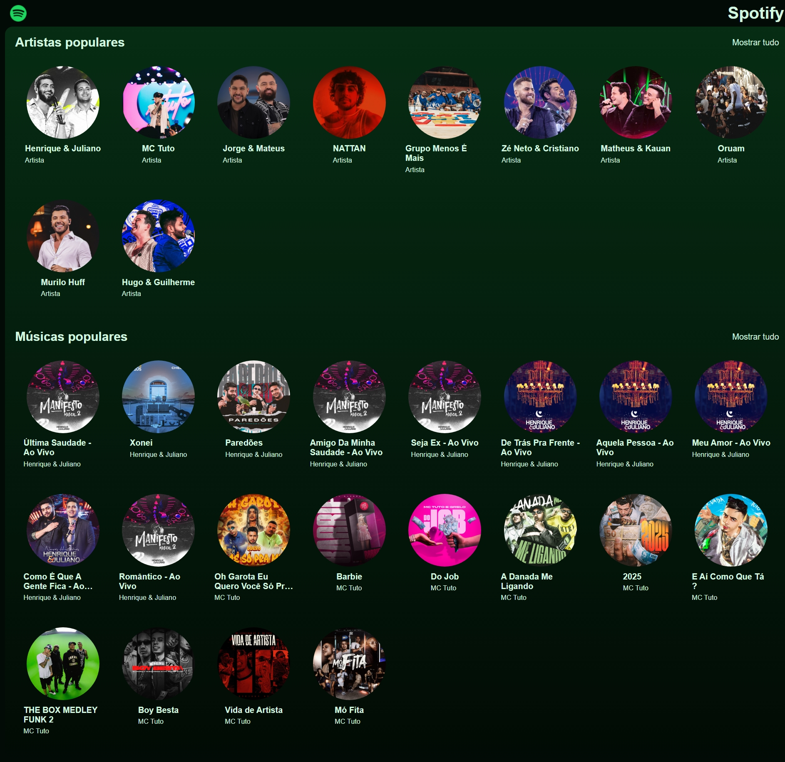
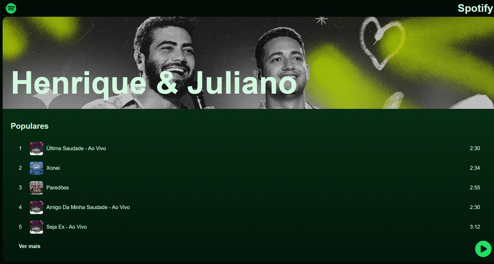

## What is it?

This project is a simple clone of the Spotify app that was developed during the Hashtag Treinamentos course. However, the project was adapted to run with **Docker**. The technologies used are:

- **Node.js** – used as the JavaScript runtime for server-side logic.
- **Vite** – used as the build tool and development server.
- **React.js** – used to build the user interface (frontend).
- **Express.js** – used to handle the backend API.
- **MongoDB** – used as the database to store application data (artists and songs).

## Objective

Train frontend development using React.js and reinforce CSS skills.

## Quickstart

Install Docker, then run:
`docker compose up -d`

Access the app at:
`localhost:5173`

## Preview

